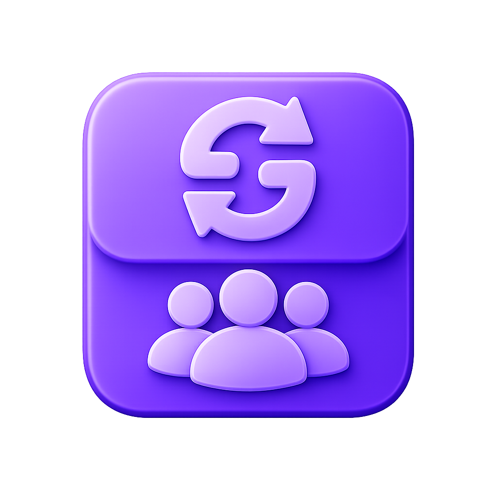
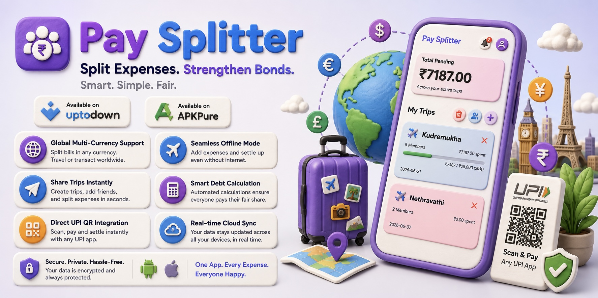

# PaySplitter — Group Expense Splitter & Verified UPI Settlement

    
  <strong>💸 Split group expenses seamlessly & settle debts with 100% verified proof!</strong> 
  The easiest way to track trip budgets, split bills with friends, and settle up through direct UPI without confusion.

  
  
  

---

  

---

## 🚀 Download & Web Access

* 📲 **Android App (Signed APK):** [Download on Uptodown](https://pay-splitter.en.uptodown.com/android)
* 🌐 **Live Web App (Instant Access):** [Open PaySplitter Web](https://paysplitter-ai.netlify.app/)
* 🔗 **Product Showcase Page:** [Visit Product Page](https://adarsh-craft.netlify.app/products/pay-splitter)

---

## ✨ Features & How They Work

### 🧮 1. Smart Debt Simplification
* **What it is:** Automatically calculates the easiest way to settle all group debts with the fewest number of payments.
* **How it works:** When multiple people pay for different things during a trip, the app consolidates everyone’s balances so friends don't have to make multiple back-and-forth payments to each other.

---

### 🍰 2. Flexible Expense Splitting
* **What it is:** Customize how each bill is divided among members.
* **How it works:** Choose to split bills **Equally**, by **Exact Amounts**, by **Percentages**, or by **Custom Shares** for members who ordered extra or different items.

---

### 📲 3. 1-Tap Direct UPI Payment
* **What it is:** Pay friends directly through your favorite UPI payment app without copying UPI IDs manually.
* **How it works:** Tap **"Pay Now"** on any settlement, and select **Google Pay**, **PhonePe**, **Paytm**, or **BHIM**. The app opens instantly with the recipient’s UPI ID, amount, and payment note already filled in.

---

### 🔲 4. Dynamic UPI QR Code Vouchers
* **What it is:** On-the-spot visual QR codes for quick in-person settlements.
* **How it works:** Generate a high-resolution UPI QR code right on your screen for a friend to scan with their camera, or save the QR voucher directly to your device's photo gallery.

---

### 🤝 5. Two-Way Settle Up & Dual-Verification
* **What it is:** A verified handshake system where debts are only closed once the recipient confirms the money was received.
* **How it works:** 
  1. The **Sender** makes the payment and taps **"Mark as Paid"**.
  2. The **Receiver** gets an instant alert to check their bank account.
  3. Once verified, the receiver taps **"Confirm Received"** to permanently close the debt for both parties.

---

### ⚠️ 6. Dispute & "Not Received" Safeguard
* **What it is:** Built-in protection against false claims, accidental clicks, or delayed bank transfers.
* **How it works:** If a sender marks an expense as paid but the money didn't reach the receiver's bank account, the receiver can tap **"Not Received"**. This flags the payment in red for mutual review without corrupting the group's total balance.

---

### 🔔 7. Real-Time Actionable Push Alerts
* **What it is:** A centralized in-app notification hub for all group activities.
* **How it works:** Receive instant alerts whenever someone adds a new expense, marks a payment as sent, or confirms that your payment was verified.

---

### 📋 8. Permanent Verified Settlement Ledger
* **What it is:** A dedicated audit history breakdown of all completed settlements.
* **How it works:** Open the **"Paid Status"** tab anytime to view verified payments with exact timestamps, payment numbers (`Pay #1`, `Pay #2`), member names, and total amounts settled.

---

### 📄 9. 1-Click PDF Report Export
* **What it is:** Downloadable, clean, and organized PDF statements for the whole group.
* **How it works:** Tap **"Export PDF"** to instantly generate a printable summary containing total spending, individual member shares, itemized expense lists, and verified settlement receipts. Works completely offline!

---

### 🔗 10. 1-Link Group & Trip Sharing
* **What it is:** Invite friends and family to collaborate on a trip in seconds.
* **How it works:** Create a trip (e.g., *"Goa Trip"*, *"Flat Rent & Groceries"*), tap **"Share Link"**, and send it on WhatsApp or any messaging app. Friends can join with one click to add and view expenses.

---

### ☁️ 11. Real-Time Cloud Synchronization
* **What it is:** Multi-device live sync powered by Google Sign-In and Cloud Database.
* **How it works:** When one friend adds an expense on their phone, it instantly updates across all other group members' screens in real-time.

---

### 📶 12. 100% Offline Mode
* **What it is:** Full app functionality even without Wi-Fi or mobile data.
* **How it works:** Keep adding expenses, checking balances, and calculating settlements in remote locations or during flights. The app automatically syncs all changes to the cloud the moment your internet reconnects.

---

### 🌍 13. Multi-Currency Engine
* **What it is:** Built for both local outings and international travel.
* **How it works:** Switch between global currencies (INR `₹`, USD `$`, EUR `€`, GBP `£`, AED `د.إ`, JPY `¥`, etc.) with one tap directly from your dashboard.

---

### 🏷️ 14. Expense Categories & Search Filters
* **What it is:** Organize and find any transaction quickly.
* **How it works:** Tag expenses with categories like **Food**, **Travel**, **Stay**, **Shopping**, **Fuel**, and **Entertainment**, and easily search or filter past bills by date or person.

---

### 👤 15. Custom Member Profiles & Avatars
* **What it is:** Personalized visual identification for every person in the group.
* **How it works:** Add custom names, profile photos, and default UPI IDs for each member to make tracking and payments effortless.

---

### 🔒 16. Privacy-First & Zero Advertisements
* **What it is:** A clean, distraction-free experience with complete data privacy.
* **How it works:** Your financial data stays strictly between you and your group members. No third-party ad popups or tracking scripts.

---

## 🛠️ Built With

* **Frontend:** HTML5, Modern CSS3, JavaScript (Vanilla ES6+)
* **Mobile Runtime:** Capacitor.js (Android Release Builds)
* **Cloud & Auth:** Firebase Authentication (Google Sign-In) & Realtime Database
* **Document Generation:** Client-Side PDF Synthesis & Vector QR Engines

---

  <i>Designed & Built with ❤️ by <strong>Adarsh Patil</strong></i>

  <small>© PaySplitter. All rights reserved. Private & Local Project.</small>

